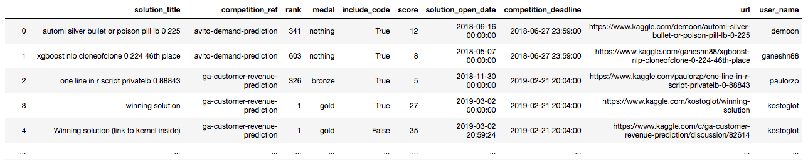

# Kaggle Solution Collecter

Collect kaggle solution from Meta Kaggle and scraping rank and medal from Kaggle.



## Requirements

- pipenv
- Kaggle account
- Google Chrome

## Usage

### 1. Setup

- Download [ChromeDriver](https://sites.google.com/a/chromium.org/chromedriver)  
  Check your chrome version.  
  Set to `./chromedriver_*.zip`.

```
$ unzip chromedriver_mac64.zip
```

- Set pipenv

```
$ pipenv shell
$ pipenv install
```

- Download Meta Kaggle

```
$ mkdir data
$ kaggle datasets download -d kaggle/meta-kaggle -p data/
```

Or download from [here](https://www.kaggle.com/kaggle/meta-kaggle).

- Unzip the zip file

```
$ unzip data/meta-kaggle.zip -d data/
```

## 2. Run scripts

```
$ python meta_kaggle.py
$ python scraping.py
$ python concat.py
```

## Credits

I refer to [this](https://www.kaggle.com/sudalairajkumar/winning-solutions-of-kaggle-competitions) kernel and appreciate [@sudalairajkumar](https://www.kaggle.com/sudalairajkumar).
